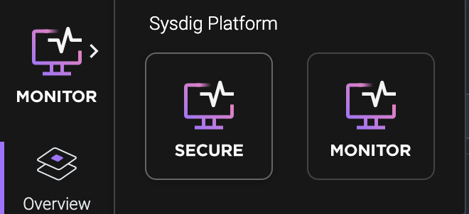
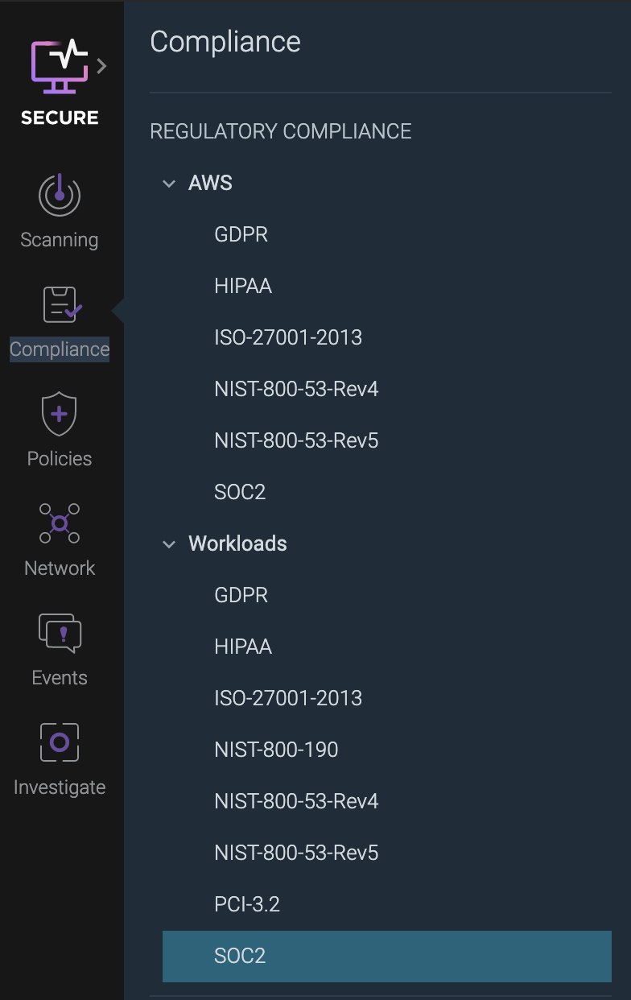

# Introduction

## Container Security with Sysdig

Welcome to our workshop! In this workshop we'll be using Sysdig Secure on IBM Cloud to scan container images and evaluate OpenShift Clusters for compliance. The goals of this workshop are:

* Scan container images
* Explore runtime scanning policies
* Take a look at compliance scanning

## Steps

### Image scanning with Sysdig Secure
In this section we will explore container image scanning with Sysdig Secure. For this workshop we will be taking a look at the Node Goat application that was built by OWASP as a purposely vulnerable application.

1. From the IBM Cloud dashboard, click on the menu button at the top left of the page, scroll down, and click on `Observability`.

    

1. Then select `Monitoring` on the left side of the page.

1. You should now see a list of instances labeled `sysdig-xxx`. Find the instance that corresponds to the cluster number that you were assigned. For example, if I was assigned a cluster ending in `-012`, then I would use `sysdig-012`. Click on `Open Dashboard`.

1. By default, you will be taken into the Sysdig Monitor side of the service. To switch to Sysdig Secure, click on the `Monitor` button at the top left and then click on the `Secure` icon that appears.

    

1. Now that we are in Sysdig Secure we need to get our api-key. Click on the circle with your initials at the bottom left of the screen that is right below the `Getting Started` button.

1. Click on `Settings`

1. Look for the section labeled `Sysdig Secure API` and copy your API token and paste it into a notepad or somewhere that you can get it later.

    

1. Now in your terminal enter the following while replacing <api_token> with your Sysdig Secure API token copied in the previous step:

    ```bash
    export SYSDIG_TOKEN=<api_token>
    ```

1. Go back to the settings page and find the tab labeled `Agent Installation` on the left side of the page.

    

1. Copy the access key that shows up and save it in a notepad or somewhere you can copy it easily later.

    

1. Go back to your terminal and enter the following, replacing <access_key> with the access key you just copied. Note: The API token and Access Key are different and cannot be used interchangeably.

    ```bash
    export ACCESS_KEY=<access_key>
    ```

1. Then we are going to deploy a container to scan a container image for us. Use the following command to deploy the scanning container:

    ```bash
    oc run --rm -it --image quay.io/sysdig/secure-inline-scan:2 -- image-scan docker.io/odrodrig/node-goat:1.0 --sysdig-token $SYSDIG_TOKEN --sysdig-url https://us-south.monitoring.cloud.ibm.com/
    ```

1. After a couple of minutes the scan will complete and it should result in a fail. Let's take a look at why. In the output of the scan there should be a url that takes you to the results page in Sysdig Secure. Copy the link and paste it into your browser.

    

1. The link should take your to the scan results page in Sysdig Secure. From here we can see that there are 23 total vulnerabilities found based on the default scanning policy. You can click on `DefaultPolicy` under the `Breakdown` section to view more specific information on why the scan failed.

    

1. This image has 5 High or Critical vulnerabilities that caused the scan to fail and a lot of warnings for various other rules that were flagged.

1. Take some time to check out the `Non-operating system` tab under `Vulnerabilities` to see a list of CVEs found for the 3rd party dependencies in the application.

    

1. You can also check out the `NPM` tab under the `Content` section to view information about the location of the package in the container, the source of the package, and most importantly the licenses used for each package.

### Compliance Scanning
In this section we will check out how to enable scanning for compliance frameworks such as PCI, SOC2, NIST-800-53, ISO27001, and more. We will do this by enabling periodic benchmarks against our workloads on the cluster.

1. Before we can start scanning our cluster we first need to install the Sysdig agent that will allow our cluster to communicate with Sysdig Secure. In your terminal, enter the following:

```bash
curl -sL https://ibm.biz/install-sysdig-k8s-agent | bash -s -- -a $ACCESS_KEY -c ingest.us-south.monitoring.cloud.ibm.com --openshift --imageanalyzer
```

1. There should be 6 pods currently being created: 1 sysdig agent per node and 1 image analyzer per node. Before we move on we need to ensure that the pods are running. Run the following command:

    ```bash
    oc get pods -n ibm-observe 
    ```

    If any pods are not yet ready, wait a few seconds and try again.

1. Next, in Sysdig Secure click on the button labeled `Compliance` on the left side of the page. From here we can scan our infrastructure for compliance to some of the more popular specifications.

1. Select `SOC2` under the `Workloads` section as the specification from the list that appears.

    

1. You should see a report with various controls that fall under the SOC2 framework. There are a few failures that can be addressed, the easiest being scheduling a CIS benchmark on our cluster. To do this, click on `Schedule CIS Benchmark` on the left side of the page under `Common Fixes` and select the first option that appears underneath it.

    

1. Then a new section will expand on the right side of the page and there should be a link to `Schedule CIS Benchmark`. Click on the link.

    

1. On the new page click on `Schedule` at the top right of the page.

1. Click on `Add Task` that appears at the top right corner of the page.

1. Next, fill out the form that appears. 

    * Give the benchmark a name such as `CIS Benchmark`
    * For `Type` select `Kubernetes benchmark`
    * You can leave the rest alone

    Click `Save` at the top right.

    

1. You now have a CIS Benchmark scheduled to run twice a day. Rather than wait, let's kick off a benchmark now. Hover over the scheduled benchmark that you just created and click on the play icon that appears to the right side of the benchmark entry.

    

1. Let's review the results by clicking on `Results` at the top left of the page.

    

    You should now see a few different results show up. The benchmark tests each one of the worker nodes in the cluster. Since we have 3 nodes, there should be 3 sets of results.

1. Click on one of the benchmark results to take a look. It doesn't matter which one.

    You can see the tests that passed or failed on this page.

    

1. Now, go back to the SOC2 regulatory compliance report page by clicking on the `Compliance` button on the left side of the page and selecting `SOC2` under the `Workloads` section.

    

1. You should notice that now there are more controls that our cluster passed. If you select the first control under `Risk Assessment` you should see that it is now a green checkmark because we have regularly scheduled CIS Benchmarks now.

    By going through each control and addressing the issues identified you can ensure that your cluster is SOC2 compliant. For this workshop, you don't have to go through each one but if you click through a few you will notice that some controls require enabling a policy with Falco rules. We will explore this in the next section.

### Security Policies and Rules
In this section we will explore the policies that you can set to alert you of suspicious activity and the rules that make them up. Sysdig Secure utilizes an Open Source intrusion detection and activity monitoring project known as Falco which was created by Sysdig and then donated to the CNCF in 2018.

Sysdig Secure comes with a set of Falco policies that can be enabled with the flick of switch but you also have the ability to create your own custom rules using the Falco syntax. For the workshop today we will be exploring the existing rules.

1. Click on the `Policies` button on the left side of the page and select `Runtime Policies`. This will take you to a page of policies that come with Sysdig Secure.

    

1. Scroll down until you see the policy called `Access Cryptomining Network` and click on the row, not the toggle switch. This should open up a new section on the right side of the page with information about the rules in this policy.

    

1. Examine the two rules: one rule alerts if container traffic includes the stratum protocol which is a protocol commonly used to communicate with a mining network. The other rule will alert if a container attempts to connect through common mining ports.

1. Enable the `Access Cryptomining Network` policy by click on the toggle switch. This policy is now in effect and will trigger if a container attempts to connect with the stratum protocol or through one of the identified common mining ports.

1. To view the events and triggered policies, check out the `Events` button on the left side of the page. This will take you to a stream of events that have triggered policy rules on the cluster.

    

## Conclusion

In this workshop we took a look at various pieces of Sysdig Secure such as container image scanning, regulatory compliance scanning, and even security policies with Falco.